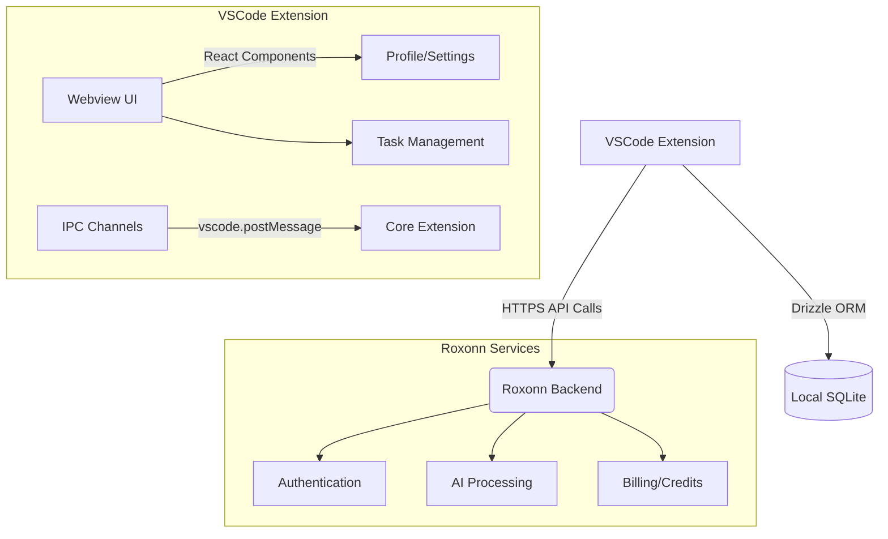

# Roxonn Code Architecture

## Key Characteristics

1. **Client-Server Architecture**: Leverages existing Roxonn infrastructure
2. **Secure Communication**: JWT authentication via HTTPS
3. **Local Persistence**: SQLite + Drizzle ORM for session data
4. **React Webview**: Component-based UI with VSCode IPC
5. **Modular Services**: Clear separation between AI processing/auth/billing
