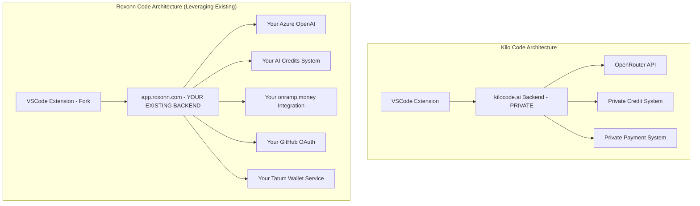
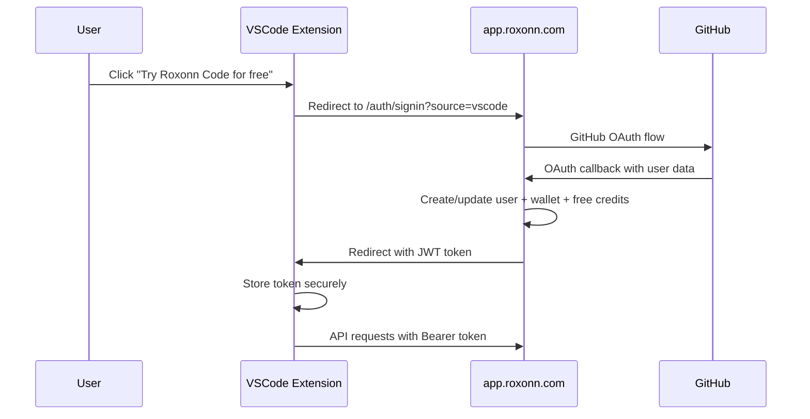

# Roxonn Code Implementation Plan

## Executive Summary

This document outlines the complete implementation plan for **Roxonn Code** - a VSCode extension that leverages your existing Roxonn platform infrastructure to provide AI-powered coding assistance. The plan maximizes reuse of your existing systems (GitHub OAuth, wallet creation, AI credits, payment processing) to create a working product in 2-3 hours.

## Table of Contents

1. [Architecture Overview](#architecture-overview)
2. [Current Infrastructure Analysis](#current-infrastructure-analysis)
3. [Implementation Strategy](#implementation-strategy)
4. [Detailed Implementation Steps](#detailed-implementation-steps)
5. [Technical Specifications](#technical-specifications)
6. [Testing & Deployment](#testing--deployment)
7. [Business Benefits](#business-benefits)
8. [Future Enhancements](#future-enhancements)

## Architecture Overview

### Current Kilo Code vs Roxonn Code



### Key Insight: Leverage Existing Infrastructure

Your Roxonn platform already has **80% of what Kilo Code built privately**:

- ✅ GitHub OAuth authentication
- ✅ Automatic wallet creation (Tatum)
- ✅ AI credits system (for n8n services)
- ✅ Payment processing (onramp.money)
- ✅ Azure OpenAI integration
- ✅ User management (PostgreSQL)
- ✅ Express backend with routing

## Current Infrastructure Analysis

### Your Existing Roxonn Platform Assets

Based on your memory bank analysis:

#### **1. Authentication & User Management**

- **GitHub OAuth**: Fully implemented via Passport.js
- **User Database**: PostgreSQL with Drizzle ORM
- **Session Management**: Express sessions with CSRF protection
- **JWT Tokens**: For API authentication

#### **2. Wallet & Payment System**

- **Tatum Integration**: Automatic wallet creation on signup
- **AWS KMS**: Secure key management
- **onramp.money**: Crypto payment processing (AppID 1553960)
- **XDC Blockchain**: Native token support

#### **3. AI Services Infrastructure**

- **AI Credits System**: Already implemented for n8n services
- **Azure OpenAI**: Integrated for n8n workflows
- **n8n Platform**: Self-hosted on AWS EC2
- **Credit Deduction Logic**: Existing payment flow

#### **4. Technical Stack**

- **Frontend**: React + TypeScript + Tailwind CSS
- **Backend**: Express + TypeScript + PostgreSQL
- **Deployment**: Docker + AWS EC2
- **Security**: AWS KMS + SSL/TLS

## Implementation Strategy

### **Phase 1: Minimal Viable Product (2-3 Hours)**

#### **Approach: Single Endpoint Integration**

Instead of rebuilding systems, add **one endpoint** to your existing backend that:

1. Authenticates VSCode users via JWT
2. Checks AI credit balance
3. Proxies requests to your Azure OpenAI
4. Deducts credits using existing logic
5. Returns responses to VSCode

#### **Why This Works:**

- **Zero New Infrastructure**: Everything runs on existing app.roxonn.com
- **Reuse Everything**: Auth, payments, credits, AI integration
- **Minimal Code Changes**: ~50 lines of new backend code
- **Immediate Revenue**: Users buy credits via existing system

## Detailed Implementation Steps

### **Step 1: Backend Integration (1 Hour)**

#### **1.1 Add VSCode AI Endpoint**

Add to your existing `server/routes.ts`:

```typescript
// Add to your existing Express routes
app.post("/api/vscode/ai/completions", requireAuth, async (req, res) => {
	try {
		// 1. Get authenticated user (existing middleware)
		const user = req.user

		// 2. Check AI credits (existing system)
		const requiredCredits = estimateRequestCost(req.body)
		if (user.aiCredits < requiredCredits) {
			return res.status(402).json({
				error: "Insufficient AI credits",
				message: "Please top up your AI credits to continue",
				currentBalance: user.aiCredits,
				required: requiredCredits,
			})
		}

		// 3. Call Azure OpenAI (existing integration)
		const response = await fetch(
			`${process.env.AZURE_OPENAI_ENDPOINT}/openai/deployments/gpt-4o/chat/completions?api-version=2024-02-15-preview`,
			{
				method: "POST",
				headers: {
					"api-key": process.env.AZURE_OPENAI_KEY,
					"Content-Type": "application/json",
				},
				body: JSON.stringify(req.body),
			},
		)

		const data = await response.json()

		// 4. Calculate actual cost and deduct credits (existing logic)
		const actualCost = calculateTokenCost(data.usage.prompt_tokens, data.usage.completion_tokens)
		await deductAICredits(user.id, actualCost)

		// 5. Log usage for analytics (existing system)
		await logAIUsage(user.id, {
			service: "vscode-ai",
			model: req.body.model,
			inputTokens: data.usage.prompt_tokens,
			outputTokens: data.usage.completion_tokens,
			cost: actualCost,
		})

		// 6. Return response
		res.json(data)
	} catch (error) {
		console.error("VSCode AI request failed:", error)
		res.status(500).json({
			error: "AI service temporarily unavailable",
			message: error.message,
		})
	}
})

// Helper function for cost estimation
function estimateRequestCost(requestBody) {
	// Rough estimation based on input length
	const inputLength = JSON.stringify(requestBody.messages).length
	const estimatedInputTokens = Math.ceil(inputLength / 4) // ~4 chars per token
	const estimatedOutputTokens = 500 // Conservative estimate

	// GPT-4o pricing: $0.005 input, $0.015 output per 1K tokens
	return (estimatedInputTokens * 0.005 + estimatedOutputTokens * 0.015) / 1000
}

function calculateTokenCost(inputTokens, outputTokens) {
	// GPT-4o pricing with small markup
	return (inputTokens * 0.006 + outputTokens * 0.018) / 1000 // 20% markup
}
```

#### **1.2 Update CORS Settings**

Ensure your existing CORS configuration allows VSCode extension requests:

```typescript
// In your existing CORS setup
app.use(
	cors({
		origin: [
			"https://app.roxonn.com",
			"vscode-webview://*", // Allow VSCode webviews
			// ... your existing origins
		],
		credentials: true,
	}),
)
```

### **Step 2: VSCode Extension Changes (30 Minutes)**

#### **2.1 Create Roxonn Provider**

Copy and modify the existing Kilo Code provider:

```bash
# Copy the existing provider
cp src/api/providers/kilocode-openrouter.ts src/api/providers/roxonn-azure.ts
```

Update the new file:

```typescript
// src/api/providers/roxonn-azure.ts
import { ApiHandlerOptions, ModelRecord } from "../../shared/api"
import { OpenAiHandler } from "./openai"
import { getModelParams } from "../getModelParams"

export class RoxonnAzureHandler extends OpenAiHandler {
	protected override models: ModelRecord = {}

	constructor(options: ApiHandlerOptions) {
		// Point to your existing backend
		const baseUrl = "https://app.roxonn.com"

		super({
			...options,
			openAiBaseUrl: `${baseUrl}/api/vscode/ai/`,
			openAiApiKey: options.roxonnToken, // JWT token from your auth
		})
	}

	override getModel() {
		// Map to your Azure OpenAI deployments
		const modelMapping = {
			"gpt-4o": "gpt-4o", // Your Azure deployment name
			"gpt-4o-mini": "gpt-4o-mini", // Your Azure deployment name
		}

		const selectedModel = this.options.roxonnModel ?? "gpt-4o"
		const id = modelMapping[selectedModel] || "gpt-4o"

		return {
			id,
			info: this.getModelInfo(id),
			...getModelParams({
				options: this.options,
				model: this.getModelInfo(id),
				defaultTemperature: 0,
			}),
			promptCache: {
				supported: false, // Disable for initial version
			},
		}
	}

	private getModelInfo(modelId: string) {
		// Return model configuration for your Azure models
		return {
			maxTokens: 128000,
			contextWindow: 128000,
			supportsImages: true,
			supportsPromptCache: false,
			inputPrice: 0.006, // Your pricing with markup
			outputPrice: 0.018,
		}
	}
}
```

#### **2.2 Register New Provider**

Add to the provider registry:

```typescript
// In src/shared/api.ts or wherever providers are registered
import { RoxonnAzureHandler } from "../api/providers/roxonn-azure"

// Add to the provider map
export const API_PROVIDERS = {
	// ... existing providers
	roxonn: RoxonnAzureHandler,
}
```

### **Step 3: Branding Updates (1 Hour)**

#### **3.1 Update Welcome Screen**

Modify [`webview-ui/src/components/kilocode/helpers.ts`](webview-ui/src/components/kilocode/helpers.ts):

```typescript
export function getRoxonnBackendAuthUrl(uriScheme: string = "vscode", uiKind: string = "Desktop") {
	const baseUrl = "https://app.roxonn.com"
	const source = uiKind === "Web" ? "web" : uriScheme
	return `${baseUrl}/auth/signin?source=${source}`
}
```

#### **3.2 Update Welcome Component**

Modify [`webview-ui/src/components/kilocode/Welcome/WelcomeView.tsx`](webview-ui/src/components/kilocode/Welcome/WelcomeView.tsx):

```typescript
// Change the auth URL function call
- href={getKiloCodeBackendAuthUrl(uriScheme, uiKind)}
+ href={getRoxonnBackendAuthUrl(uriScheme, uiKind)}
```

#### **3.3 Update Text Strings**

Modify [`webview-ui/src/i18n/locales/en/kilocode.json`](webview-ui/src/i18n/locales/en/kilocode.json):

```json
{
	"welcome": {
		"greeting": "Welcome to Roxonn Code",
		"introText": "Get started with AI-powered coding assistance using your Roxonn account.",
		"ctaButton": "Try Roxonn Code for free",
		"manualModeButton": "Configure manually"
	}
}
```

#### **3.4 Update Package Information**

Modify [`package.json`](package.json):

```json
{
	"name": "roxonn-code",
	"displayName": "Roxonn Code",
	"description": "AI-powered coding assistant with crypto payments",
	"publisher": "roxonn",
	"repository": {
		"type": "git",
		"url": "https://github.com/roxonn/roxonn-code"
	}
}
```

### **Step 4: Authentication Integration (30 Minutes)**

#### **4.1 Update OAuth Callback Handler**

Modify your existing GitHub OAuth callback to handle VSCode source:

```typescript
// In your existing auth routes
app.get("/auth/signin", (req, res, next) => {
	const { source } = req.query

	// Store source for post-auth redirect
	req.session.authSource = source

	passport.authenticate("github", {
		scope: ["user:email", "read:user"],
	})(req, res, next)
})

app.get("/auth/github/callback", passport.authenticate("github", { failureRedirect: "/login" }), (req, res) => {
	const source = req.session.authSource

	if (source === "vscode") {
		// Generate JWT for VSCode
		const token = jwt.sign(
			{
				userId: req.user.id,
				email: req.user.email,
				walletAddress: req.user.walletAddress,
			},
			process.env.JWT_SECRET,
			{ expiresIn: "30d" },
		)

		// Redirect to VSCode with token
		res.redirect(`vscode://roxonn.roxonn-code/auth?token=${token}`)
	} else {
		// Normal web redirect
		res.redirect("/dashboard")
	}
})
```

#### **4.2 Add Free Credits for New Users**

Ensure your existing user registration gives free AI credits:

```typescript
// In your existing user registration logic
async function createNewUser(githubProfile) {
	const user = await db.users.insert({
		githubId: githubProfile.id,
		email: githubProfile.email,
		// ... other fields
		aiCredits: 1000, // $10 worth of free credits
	})

	// Your existing wallet creation logic
	await createUserWallet(user.id)

	return user
}
```

## Technical Specifications

### **API Endpoints**

#### **VSCode AI Completion Endpoint**

```
POST /api/vscode/ai/completions
Authorization: Bearer <jwt-token>
Content-Type: application/json

Request Body: OpenAI-compatible chat completion request
Response: OpenAI-compatible chat completion response
```

#### **Error Responses**

```json
// Insufficient credits
{
  "error": "Insufficient AI credits",
  "message": "Please top up your AI credits to continue",
  "currentBalance": 5.50,
  "required": 10.00
}

// Service error
{
  "error": "AI service temporarily unavailable",
  "message": "Azure OpenAI service is down"
}
```

### **Authentication Flow**



### **Credit System Integration**

#### **Cost Calculation**

```typescript
// Pricing with markup over Azure costs
const PRICING = {
	"gpt-4o": {
		input: 0.006, // $0.006 per 1K tokens (20% markup)
		output: 0.018, // $0.018 per 1K tokens (20% markup)
	},
	"gpt-4o-mini": {
		input: 0.0018, // $0.0018 per 1K tokens (20% markup)
		output: 0.0072, // $0.0072 per 1K tokens (20% markup)
	},
}
```

#### **Credit Deduction Flow**

1. **Pre-request**: Estimate cost and check balance
2. **Post-request**: Calculate actual cost from usage
3. **Deduction**: Use existing `deductAICredits()` function
4. **Logging**: Track usage for analytics

## Testing & Deployment

### **Testing Checklist**

#### **Backend Testing**

- [ ] VSCode AI endpoint responds correctly
- [ ] JWT authentication works
- [ ] Credit checking and deduction works
- [ ] Azure OpenAI integration works
- [ ] Error handling for insufficient credits
- [ ] CORS allows VSCode requests

#### **VSCode Extension Testing**

- [ ] Authentication flow completes
- [ ] AI requests work end-to-end
- [ ] Usage tracking displays correctly
- [ ] Error messages show properly
- [ ] Token refresh works

#### **Integration Testing**

- [ ] New user signup gets free credits
- [ ] Credit top-up via onramp.money works
- [ ] Usage appears in existing analytics
- [ ] Multiple concurrent requests work

### **Deployment Steps**

#### **Backend Deployment**

1. Deploy updated backend to app.roxonn.com
2. Update environment variables for Azure OpenAI
3. Test endpoint with curl/Postman
4. Monitor logs for errors

#### **VSCode Extension Deployment**

1. Build extension: `npm run build`
2. Package extension: `vsce package`
3. Test locally: Install .vsix file
4. Publish to marketplace: `vsce publish`

## Business Benefits

### **Immediate Value**

- **Revenue Stream**: Users buy AI credits via existing payment system
- **User Acquisition**: VSCode developers discover Roxonn platform
- **Cross-selling**: VSCode users might use n8n AI services
- **Brand Extension**: Roxonn becomes known in developer tools

### **Strategic Advantages**

- **Developer Ecosystem**: Tap into 20M+ VSCode users
- **Crypto Adoption**: Introduce developers to crypto payments
- **Platform Growth**: Increase user base and engagement
- **Data Insights**: Understand developer AI usage patterns

### **Financial Projections**

```
Conservative Estimates:
- 1,000 active users in first month
- $20 average monthly spend per user
- $20,000 monthly revenue
- 70% gross margin = $14,000 monthly profit

Growth Scenario:
- 10,000 active users by month 6
- $200,000 monthly revenue
- $140,000 monthly profit
```

## Future Enhancements

### **Phase 2: Enhanced Features (Month 2-3)**

- **Multiple AI Models**: Support Claude, Gemini via your backend
- **Code Context**: Better integration with VSCode workspace
- **Usage Analytics**: Detailed dashboard for users
- **Team Accounts**: Shared credit pools for organizations

### **Phase 3: Advanced Integration (Month 4-6)**

- **Custom Models**: Support for fine-tuned models
- **Workflow Integration**: Connect with n8n services
- **Marketplace**: Allow users to share AI prompts/workflows
- **Enterprise Features**: SSO, compliance, audit logs

### **Phase 4: Decentralized AI Vision (Month 6+)**

- **Compute Network**: Users contribute compute for ROXN rewards
- **Model Hosting**: Decentralized model serving
- **Community Governance**: ROXN token voting on features
- **Mobile Integration**: AI assistance on mobile devices

## Risk Mitigation

### **Technical Risks**

- **Azure Limits**: Monitor API quotas and scale accordingly
- **Performance**: Cache responses and optimize for speed
- **Security**: Regular security audits and token rotation

### **Business Risks**

- **Competition**: Differentiate with crypto payments and decentralization
- **Adoption**: Focus on developer experience and onboarding
- **Regulation**: Stay compliant with crypto payment regulations

## Success Metrics

### **Technical KPIs**

- API response time < 2 seconds
- 99.9% uptime
- Error rate < 1%
- Token refresh success rate > 99%

### **Business KPIs**

- Monthly active users
- Revenue per user
- Credit purchase conversion rate
- User retention rate
- Cross-platform usage (web + VSCode)

## Conclusion

This implementation plan leverages your existing Roxonn infrastructure to create a competitive VSCode AI assistant in minimal time. By reusing your authentication, payment, and AI systems, you can focus on user experience and market penetration rather than rebuilding infrastructure.

The phased approach allows for rapid MVP deployment while building toward your long-term vision of decentralized AI compute. The integration with your existing platform creates natural synergies and cross-selling opportunities.

**Next Steps:**

1. Review and approve this plan
2. Set up development environment
3. Implement Phase 1 (2-3 hours)
4. Test with beta users
5. Launch to VSCode marketplace
6. Monitor metrics and iterate

---

_This document should be updated as implementation progresses and new requirements emerge._
